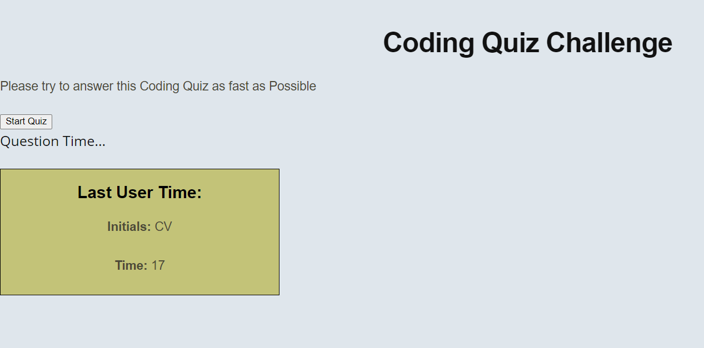

# Homework 4
## Code Quiz

Code Quiz is an application that answer three questions to the user, the user have 60 seconds to answer the questions and if the user gets a wrong answer 10 seconds are substracted from the counter 

- 60 seconds to answer
- Build in html, css and Javascript
- Final result saved as a local variable

## Preview

The following image is a preview of the webpage:

